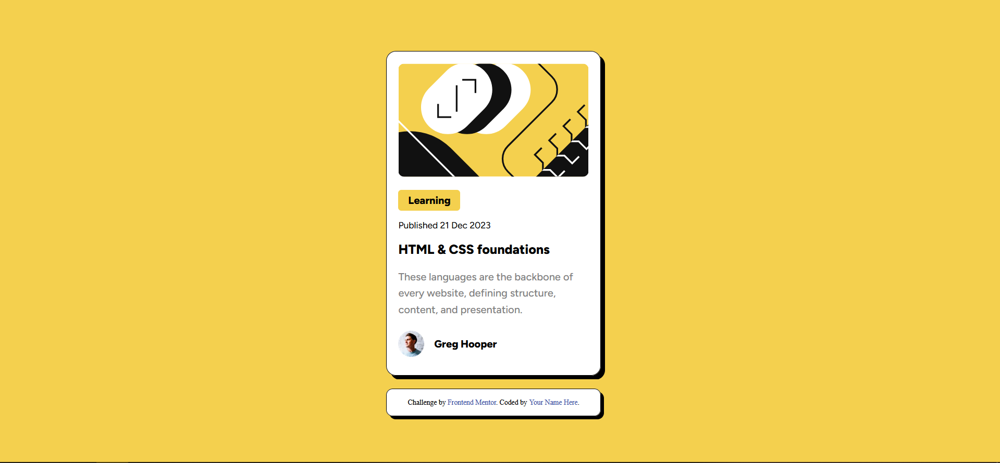

# Frontend Mentor - Blog preview card solution

This is a solution to the [Blog preview card challenge on Frontend Mentor](https://www.frontendmentor.io/challenges/blog-preview-card-ckPaj01IcS). Frontend Mentor challenges help you improve your coding skills by building realistic projects. 

## Table of contents

- [Overview](#overview)
  - [The challenge](#the-challenge)
  - [Screenshot](#screenshot)
  - [Links](#links)
  - [Built with](#built-with)
- [Author](#author)

## Overview

### The challenge

Users should be able to:

- See hover and focus states for all interactive elements on the page

### Screenshot

- Desktop design: 
- Mobile design: 

### Links

- Solution URL: https://github.com/LisFoxG/Blog_preview_card
- Live Site URL: https://lisfoxg.github.io/Blog_preview_card

### Built with

- Semantic HTML5 markup
- CSS Grid

## Author

- Frontend Mentor - https://www.frontendmentor.io/profile/LisFoxG

